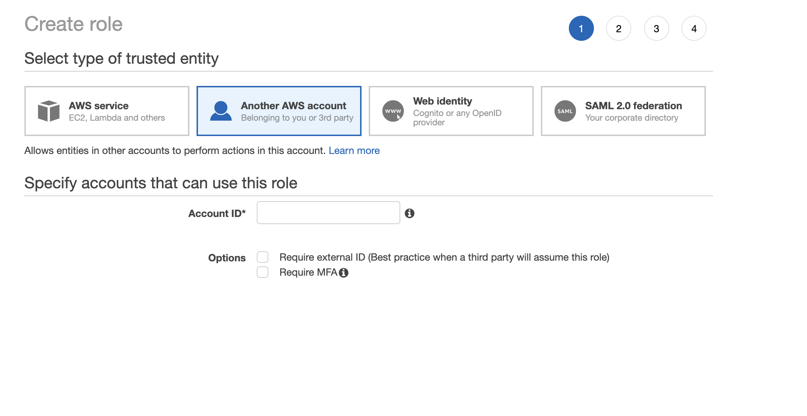
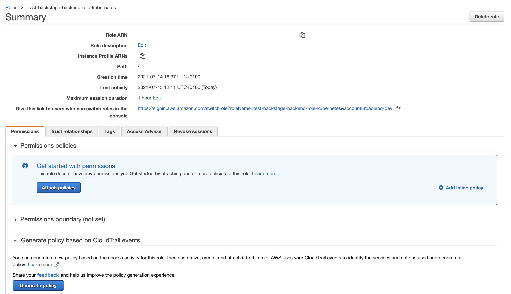

## Prerequisites

* The Roadie account ID.
* The Roadie backend role.
* (optional) An aws permissions policy name to associate with the role. 

The above are accessible via `Administration > Settings > AWS S3`.

## Introduction

You may want Roadie to be able to access AWS services such as EKS or S3 in your account. In order to do this you must 
provide us with an identity in your account which we can assume. We use roles for this purpose. This document will describe 
how to create such a role.

To learn more about the AWS concepts used below, you can read the following AWS documentation pages:

* [Assuming Role](https://docs.aws.amazon.com/STS/latest/APIReference/API_AssumeRole.html)
* [Cross Account Federation](https://docs.aws.amazon.com/IAM/latest/UserGuide/id_roles_common-scenarios_third-party.html)
* [Trust relationship](https://aws.amazon.com/en/blogs/security/how-to-use-trust-policies-with-iam-roles/)

## Step 1: Creating the cross account federation role

1. Sign into your AWS console and navigate to the [IAM service](https://console.aws.amazon.com/iam/home#/home).

2. Click on ”Role” link (this should be on the left-hand side of your screen).

3. Click on the ”Create Role” button.

4. Click on ”Another AWS Account” and add the Roadie account ID and then click on ”Next: permissions”.



5. Click the checkbox beside "Require External ID" and enter some unique value (e.g. a uuid). Make a note of this value as you'll need it later.

6. Attach any desired policies and click on ”Next”.  
   Note: You may not need to add any policies at this stage.
   Optional: Add a tag, Key: `3rdPartyIntegration` Value: `Roadie`

7. Click ”Next”

8. For the ”Role Name” enter: ”<mycompany>-roadie-read-only-role”

⚠️ ”<mycompany>” should be replaced by the lower cased value of your company (e.g. "mycompany-roadie-read-only-role") and should follow the convention highlighted above. If it does not follow the convention, the role cannot be assumed. This is for security reasons.

9. For the ”Role description” enter a description such as:

```
This is a role that will be assumed by Roadie to access AWS resources in this account.
```

10. It should look like this


11. Click ”Create role”. Your cross federation role is now created.

## Step 2: Restrict the new role trust relationships to Roadie only

1. Search for IAM in the services box and then click on ”Roles” on the left handside tab.

2. Search for your newly created role (e.g. ”roadie-read-only-role”) and click on it.

You should see a page like this



3. Click on ”Trust Relationships”, then ”Edit relationship” and add the text below filling in the values:

``` json
{
  "Version": "2012-10-17",
  "Statement": [
    {
      "Effect": "Allow",
      "Principal": {
        "AWS": [
          "<ROADIE ACCOUNT ID>"
        ]
      },
      "Action": "sts:AssumeRole",
      "Condition": {
        "StringEquals": {
          "sts:ExternalId": "<EXTERNAL ID AS CONFIGURED ABOVE>"
        },
        "StringLike": {
          "aws:PrincipalArn": [
            "*<ROADIE BACKEND ROLE>*"
          ]
        }
      }
    }
  ]
}
```

ℹ️  The PrincipalArn might be something like `*mycompany-roadie-read-only-role*`

4. Save the changes.
