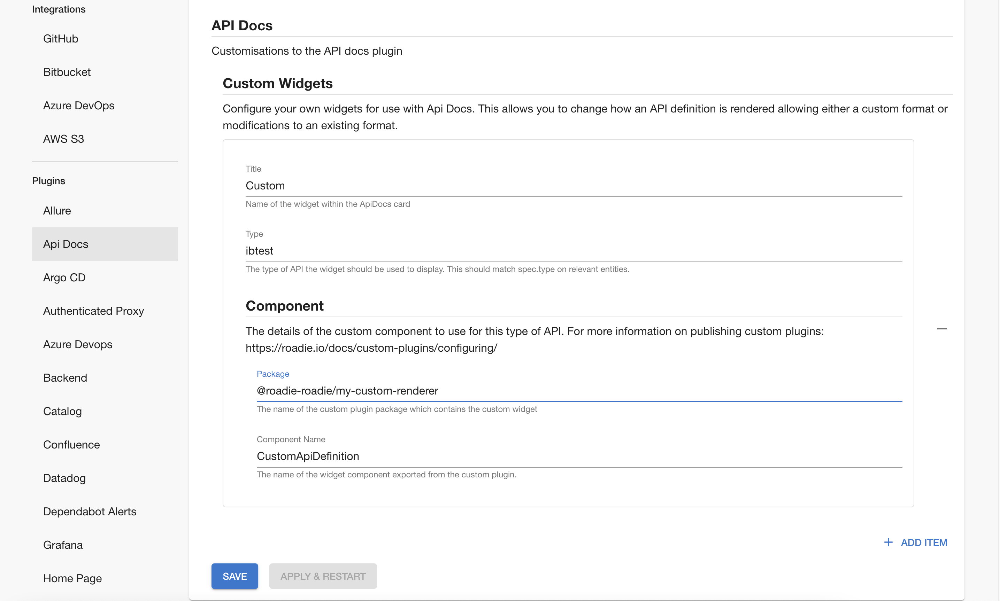

## Introduction

The API docs plugin supports user supplied renderers for API definitions. This page explains how you can configure such
a renderer in roadie.

## Prerequisites

* You must have custom plugins enabled for your tenant. Contact Roadie to enquire about this.

## Step 1: Write a custom renderer

Write a [custom API docs renderer](https://www.npmjs.com/package/@backstage/plugin-api-docs#custom-api-renderings). 
This is a React component which takes the API definition as a prop and renders it.

## Step 2: Publish your custom renderer

Read [the docs on custom plugins](../../custom-plugins/configuring) and publish a plugin which exports your custom renderer.
Be sure to configure the renderer as a component with ApiDocsWidget type.

## Step 3: Configure the renderer in settings

It is necessary to configure the type of entity the custom renderer applies to in settings at /administration/settings/api-docs.
First click "add item" then enter the custom renderer information. The type should match the `spec.type` field on API entities
this should be used to render. The title is showed as the name of the format in the API docs card. The component is then 
specified and this should match the custom component registered in step #2 
(Caveat: it can take some time for a custom component to become available for use) 

