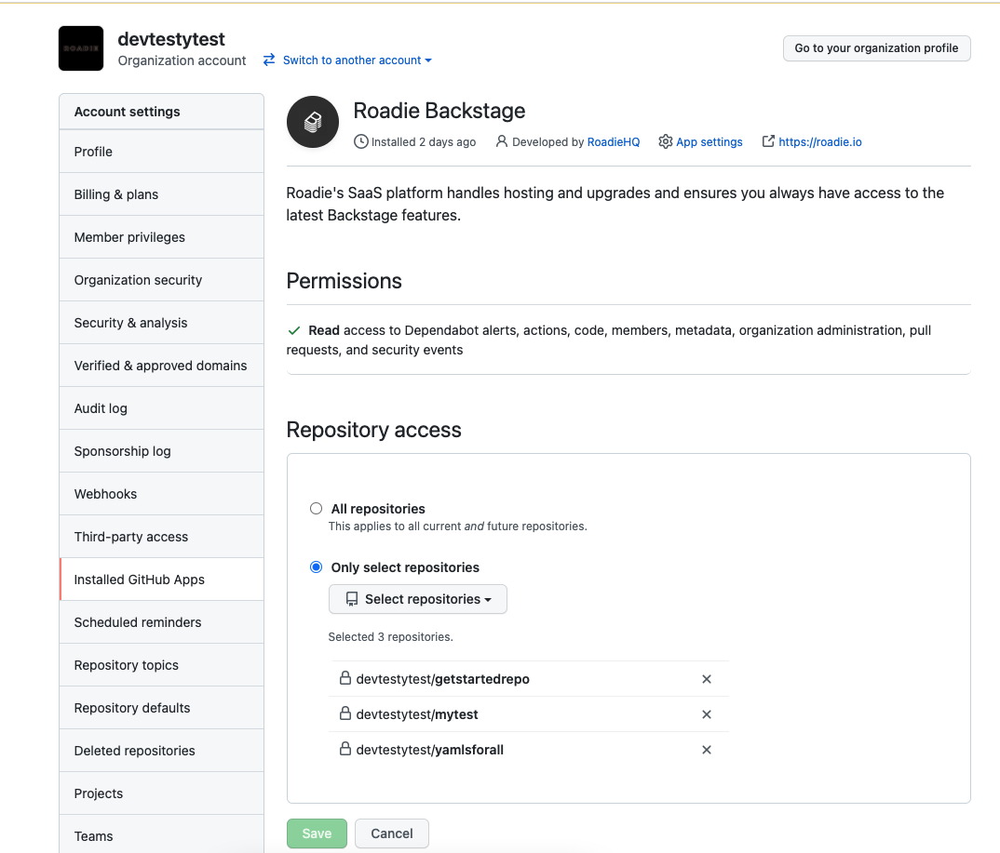

## Introduction

This tutorial will show you how to add components such as services or websites to the Backstage catalog.

## Prerequisite 

You must instal the GitHub App in order to import components in private repositories. The steps to do this are [here](../../getting-started/install-github-app/).

## Step 1: Create your 'catalog-info.yaml' file

Create a file called `catalog-info.yaml` in the root of your GitHub repo and add the following YAML to it. 

Make sure to update the following variables:

 1. Set `<github-org>` to the name of your GitHub organization.
 2. Set `<github-repo>` to the name of your repo.
 2. Set `<github-username>` to your GitHub username.

```yaml
apiVersion: backstage.io/v1alpha1
kind: Component
metadata:
  name: <github-repo>
  title: Sample Service # optional, human readable component name
  description: My first Backtstage catalog item.
  annotations:
    github.com/project-slug: <github-org>/<github-repo>
spec:
  type: service
  owner: user:<github-username>
  lifecycle: experimental
```

## Step 2: Import Your Component YAML file into Backstage

Components can be manually added to Backstage by using the catalog importer available at `/catalog-import`. 

To do this, simply copy/paste the URL of the YAML file into the importer (see video below).

[](https://www.loom.com/share/b96f07f0579a423f8cb762e8c1b7f3fe "Adding a Component")

To automatically discover `catalog-info.yaml` files, you can also set up a location entity. For more information on this, please visit [here](../../integrations/github-discovery/).

ℹ️ Note: If you are only trialing backstage, we do not recommend setting up the discovery. It is much easier to manually add files through the catalog importer. Feedback is also much faster.

## Step 3: View your Component

Click the Home link in the Backstage sidebar to go back to the catalog where you should see your component. Depending on the type of component you imported, you might have to cycle through the tabs until you see your component.


## TroubleShooting FAQs

**Component Not Appearing?**

If your component is not appearing make sure Backstage has permissions to read the repo that you added the yaml file to.

You can check this by going to the Github settings of a repo that Backstage already has access to, then follow `Settings>Integrations>Configure`, and making sure your repo is listed in the allowed repos:



## What Next? 

Let's [add some docs to the component we just created](../../getting-started/technical-documentation/) so that others in your organization can easily learn how to use it.
