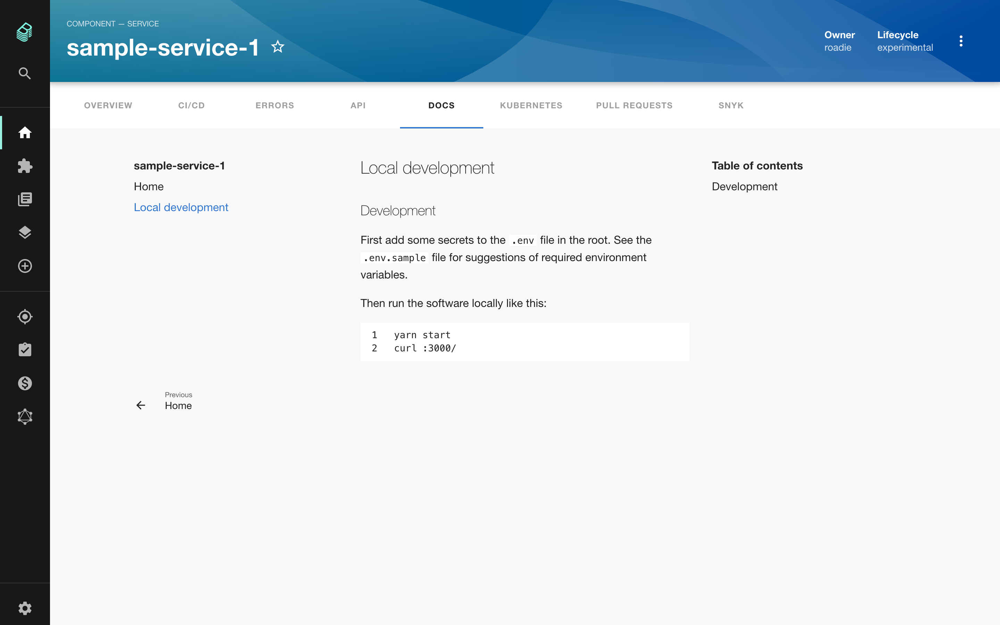

---

## Introduction

The TechDocs feature of Roadie Backstage allows markdown files written alongside the code of your components to appear in Backstage as styled HTML documentation. Because this documentation is centralized in Backstage, it is more likely to be found and used by other people in your organization.


## Adding documentation to a component

Under the hood, Backstage uses the popular [MkDocs library](https://www.mkdocs.org/) to render documentation.

### Step 1: Add the mkdocs configuration file

Create a file called `mkdocs.yml` in the root of a component you want to document in Backstage. Inside that YAML file, add the following content, replacing `{component-name}` with the human name of your component.

```yaml
site_name: '{component-name}'

nav:
  - Home: index.md

plugins:
  - techdocs-core
```

### Step 2: Add markdown documentation

Create a directory called `docs` in the root of your component. Inside that directory, create a file called `index.md` with some markdown content inside. No frontmatter is required.

```markdown
This is the documentation.
```

Your component's directory structure should now look something like this:

```
├── README.md
├── catalog-info.yaml
├── docs
│   └── index.md
├── mkdocs.yml
└── src
    └── // The code of your component
```

Ensure you publish this new content to GitHub.

### Step 3: Update the YAML metadata

We can use the `catalog-info.yaml` file of our component to tell Backstage where to find the documentation.

To do this, add the `backstage.io/techdocs-ref` annotation to the list of annotations. 

If your docs are in the root of the repo, as described above, you can set the techdocs annotation to this:

```yaml
annotations:
  backstage.io/techdocs-ref: dir:.
```

If your docs are located elsewhere, you must explicitly point to them like this:

```yaml
apiVersion: backstage.io/v1alpha1
kind: Component
metadata:
  name: sample-service
  description: # ...
  annotations:
    backstage.io/techdocs-ref: url:https://github.com/your-org/your-repo/tree/main
spec:
  type: service
  owner: engineering
  lifecycle: experimental
```

⚠️  The GitHub URL **must** be prefixed with `url:` or the documentation will not render in Backstage.

### Step 4: Publish your documentation

Commit the changes made in steps 1 through 3 to your repository. Roadie Backstage will pick up the changes shortly after they are merged to the default branch.

## Viewing documentation in Backstage

To view your documentation in Backstage, first find the service in your service catalog and click it to open the Overview page.

On the Overview page, click Docs in the tab bar. You should now see your documentation.


## Customize graphs in TechDocs

In order to customize the look of the graphs you will need to use the [Graphviz attributes](https://graphviz.org/doc/info/attrs.html). Setting different values for specific set of attributes will result in graph being rendered that way. For example, let's say we want to change background color from white to lightblue in following graph: 


which could be defined in TechDocs with following code:

```

```

Adding 'bgcolor' attribute in the Graphviz code above (so its final form is):

```

```

will result in graph being rendered in lightblue color.


This way you can customize the graph adding or removing any attribute you want. 


## Adding more docs

Let's add a page called Local Development to our docs.

First create a markdown file called `local-development.md` inside the `docs` directory of our component. Add some content to it.

Next, edit `mkdocs.yml` to make it aware of the newly created documentation page.

```yaml
site_name: 'sample-service'

nav:
  - Home: index.md
  - Local Development: local-development.md

plugins:
  - techdocs-core
```

Commit and merge these changes to the default branch of your repo on GitHub and Backstage will pick up the changes after a short period of time.



## Further reading

1. Backstage TechDocs uses MkDocs under the hood and the [MkDocs configuration and user guide](https://www.mkdocs.org/) will broadly apply to your Backstage documentation setup.
2. The [official Backstage TechDocs guide](https://backstage.io/docs/features/techdocs/techdocs-overview).

## Next steps

If you use OpenAPI specs in your organization you can [learn how to associate them with your components](../../getting-started/openapi-specs).
