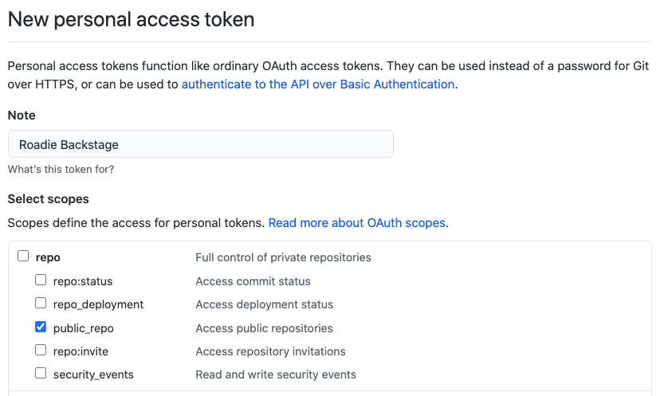
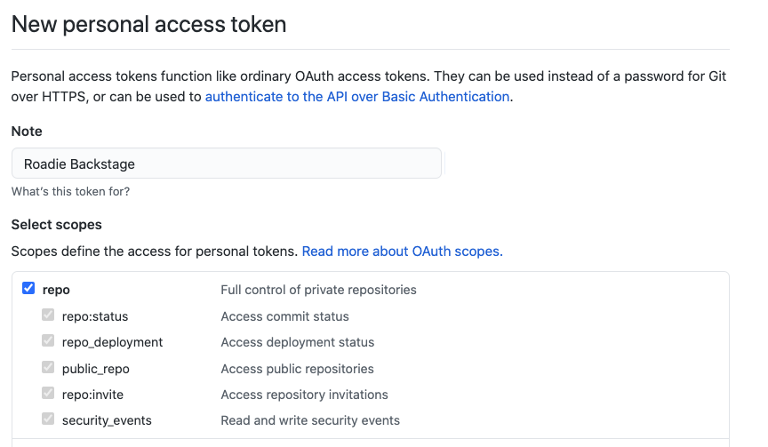

humanName: GitHub Token
logoImage: '../../../assets/logos/github/mark/official/PNG/GitHub-Mark-120px-plus.png'
integrationType: Integration
---

> **This Page Deprecated**
>
> We now recommend installing the Roadie GitHub App instead.

## Introduction

Roadie needs an access token to authenticate with the GitHub APIs in order to perform key functions such as:

1. Reading the `catalog-info.yaml` files in the root of each GitHub repository.
2. Reading users and teams from your GitHub organization so you can associate teams with the services they own.
3. Creating and writing to repositories when users use the scaffolder to create new services.

There are multiple ways to create and grant scopes on the access token, depending on the level of access that you wish Backstage to have.

This doc covers examples 1 and 2 only. Example 3 requires additional scopes - repository write access.

Unfortunately, Roadie cannot import any repositories, even open-source repositories, without access to a GitHub personal access token.

We strongly recommend you use a GitHub bot account to create the personal access token. This will allow you to strictly limit the access that Roadie has to your GitHub account. You can lock it down to public repositories and/or a small number of repositories.

## Creating a token

### Option 1: Read only access to organization data and public repositories only

Create a new GitHub user (bot account), and give it a username and password.

Add the user to your GitHub organization, in a way which ensures that it has read only access to the repositories in the organization.

For example, here's a `roadiebot` user, which does not have write access to the private RoadieHQ/stargazers-notifications repository.

Create a personal access token for this user and give it the `public_repo`, `read:org`, `read:user` and `user:email` scopes.

Use this personal access token in Roadie. Roadie now has read only access to organizational data and public repositories.

### Option 2: Read only access to organization data and public and private repositories

Create a new GitHub user (or reuse the user from Option 1 above), and give them a username and password.

Add the user to your GitHub organization, in a way which ensures that they have read only access to the repositories in the organization.

For example, here's a `roadiebot` user, which does not have write or admin access to the private RoadieHQ/stargazers-notifications repository.

Create a personal access token for this user, give it the `repo`, `read:org`, `read:user` and `user:email` scopes.

The `repo` scope provides both read and write abilities to both public and private repositories. In this case however, because the user associated with the token only has read access, no writes can occur.

## Next steps

Once you have a token you can [add it to Roadie](../../getting-started/install-github-app/).

## References

- [GitHub docs for creating personal access tokens](https://docs.github.com/en/github/authenticating-to-github/creating-a-personal-access-token)
- [GitHub explanation of access token scopes](https://docs.github.com/en/developers/apps/scopes-for-oauth-apps)
- [Backstage docs](https://backstage.io/docs/integrations/github/locations)
