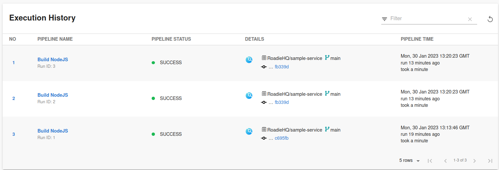
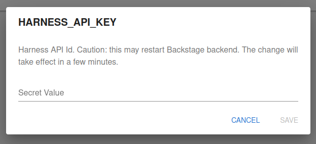

humanName: Harness.io
logoImage: '../../../assets/logos/harness/harness.png'
integrationType: OSS plugin
---

## Introduction

The [Backstage Harness plugin](https://github.com/harness/backstage-plugins/tree/main/plugins/harness-ci-cd) integrates with Harness to show your build information inside Backstage where it can be associated with your services.



## Add Harness to one of your components

### Add the needed Harness annotation(s)

The Harness plugin enables 3 usable annotations that are available to correctly identify the Harness pipelines. 

The available annotation can be seen below on the example catalog-info.yaml file: 
```yaml
metadata:
  annotations:
    # mandatory annotation
    harness.io/project-url: <harness_project_url>

    # optional annotations
    # harness.io/ci-pipelineIds: <pipelineId1,pipelineId2,pipelineId3 etc>
    # harness.io/cd-serviceId: <serviceId>
```

To find the correct values to use for annotations, refer to the [official plugin documentation in their GitHub repository](https://github.com/harness/backstage-plugins/blob/main/plugins/harness-ci-cd/PluginConfiguation.md).


### Add you API Key

Navigate to your Roadie instance secrets page and add the relevant secret referring to your Harness API key.
You can find the secrets page via navigation path `Administration` -> `Settings` -> `Secrets`
The secret name to use is `HARNESS_API_KEY`.



You can generate the API key on your Harness account using [the official API key generation instruction on Harness website.](https://developer.harness.io/docs/platform/role-based-access-control/add-and-manage-api-keys/)

### Enable and configure the plugin

Navigate to your Roadie instance and Harness configuration section. Enable the relevant Harness proxy to be able retrieve information from Harness.io. Additionally, you can disable the possibility to run pipelines via Roadie UI if needed.


### Configure Roadie UI to display Harness information

In Roadie, find and select a relevant entity via the Catalog page or using Search.

Click the plus icon on the tab bar to add a new plugin for your component.

Select the `EntityHarnessCiCdContent` card from the drop-down and click Create.

You should now see your Harness pipeline runs inside Roadie!


## References

- [Harness Plugin Documentation](https://github.com/harness/backstage-plugins/tree/main/plugins/harness-ci-cd)
- [Harness Plugin Configuration Options](https://github.com/harness/backstage-plugins/blob/main/plugins/harness-ci-cd/PluginConfiguation.md)
- [Harness Documentation to generate API keys](https://developer.harness.io/docs/platform/role-based-access-control/add-and-manage-api-keys/)

