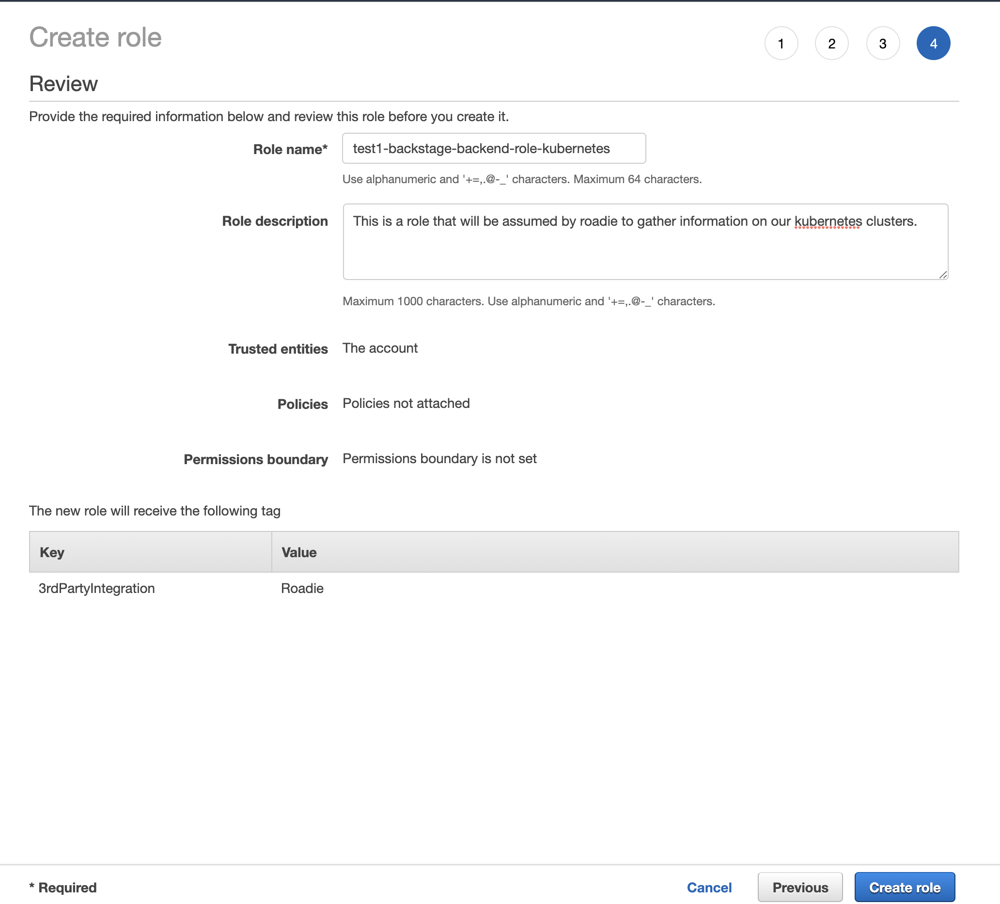
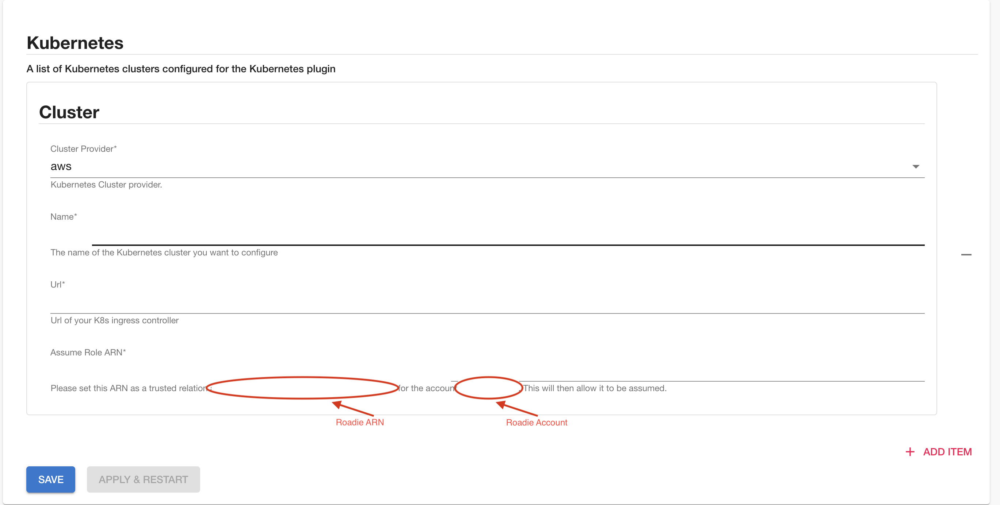

humanName: Kubernetes
logoImage: '../../../assets/logos/kubernetes/logo-kubernetes.png'
integrationType: OSS plugin
---


# Introduction
The kubernetes plugin in Backstage allows you to add details about your services, pods, deployments etc to the component dashboard pages within Backstage. The plugin supports multiple different mechanisms to connect Backstage to kubernetes. Roadie supports AWS EKS, GCloud GKE and a self deployed kubernetes cluster using a service account.

# Prerequisites
The API url of the cluster must be available to the Roadie infratructure services. You can choose to limit the availablity to our [IP networks](../../details/allowlisting-roadie-traffic/).

# AWS EKS

## Introduction

In order to use the Kubernetes plugin for AWS, Roadie needs:
 * An Assumed Role to fetch the resources from your cluster
 * The name of your cluster
 * URL of your Kubernetes API Server endpoint


These are set within Roadie at the following url:

```text
https://<tenant-name>.roadie.so/administration/settings/kubernetes
```

This page describes how to create and set up the API token.

## Steps

In this section we will create an AWS role that will grant Roadie read-only access to your Kubernetes cluster’s resources.

We will use the approach which is recommended by AWS for providing this type of access. To learn more about the AWS concepts used below, you can read the following AWS documentation pages:

 * Assuming Role [learn more](https://docs.aws.amazon.com/STS/latest/APIReference/API_AssumeRole.html)
 * Cross Account Federation [learn more](https://docs.aws.amazon.com/IAM/latest/UserGuide/id_roles_common-scenarios_third-party.html)
 * Kubernetes RBAC [learn more](https://kubernetes.io/docs/reference/access-authn-authz/rbac/)
 * Trust relationship [learn more](https://aws.amazon.com/en/blogs/security/how-to-use-trust-policies-with-iam-roles/)

### Step 1: Creating the cross account federation role

1. Sign into your AWS console and navigate to the [IAM service](https://console.aws.amazon.com/iam/home#/home).

2. Click on ”Role” link (this should be on the left handside of your screen).

3. Click on the ”Create Role” button.

4. Click on ”Another AWS Account” and add the account number on on the Kubernetes configuration page (in Roadie) and then click on ”Next: permissions”.


5. Click the checkbox beside "Require External ID" and enter some value.

6. Ignore attached policies and click on ”Next: tags” (Roadie does not need to read your AWS resources, only access to your Kubernetes cluster).

Optional: Add a tag, Key: `3rdPartyIntegration` Value: `Roadie`

7. Click ”Next Review”

8. For the ”Role Name” enter: ”**[your company name]**-roadie-read-only-role”

> Note: ”**[your company name]**” should be replaced by the lowercased value of your company and must follow the convention highlighted above. If it does not follow the convention, the role cannot be assumed. This is for security reasons.

9. For the ”Role description” enter suggested description

```
This is a role that will be assumed by roadie to gather information on our Kubernetes clusters.
```
It should look like this



10. Click ”Create role”. Your cross federation role is now created.

### Step 2: Modifying trust relationships to only include the new role

1. Get the role of the Roadie backend. This is displayed on the Kubernetes config page `/administration/settings/kubernetes`.



2. Search for IAM in the services box and then click on ”Roles” on the left handside tab.

3. Search for your newly created role: ”**[your company name]**-roadie-read-only-role” and click on it.
You should see a page like below. Record the role arn. This is your assumable role arn which you'll need to configure RBAC in kubernetes.


3. Click on ”Trust Relationships”, then ”Edit relationship” and add the text below:

``` json
{
  "Version": "2012-10-17",
  "Statement": [
    {
      "Effect": "Allow",
      "Principal": {
        "AWS": [
          "ACCOUNT ARN SUPPLIED ON THE CONFIGURATION PAGE"
        ]
      },
      "Action": "sts:AssumeRole",
      "Condition": {
        "StringEquals": {
          "sts:ExternalId": "EXTERNAL ID AS CONFIGURED ABOVE"
        },
        "StringLike": {
          "aws:PrincipalArn": [
            "*[Roadie backend role name]"
          ]
        }
      }
    }
  ]
}
```
 > In the Json fragment above, replace the "[Roadie backend role name]" with the role that is provided to you on the Kubernetes configuration page (See step 1). Note the leading `*` is required.

4. Save the changes.

### Step 3: Set RBAC for new role

1. Edit your Kubernetes aws-auth Configmap as per [the EKS docs](https://docs.aws.amazon.com/eks/latest/userguide/add-user-role.html).

It should look something like this:

``` yaml
 - mapRoles:
   - "groups":
      - "system:authenticated"
      "rolearn": "[ASSUMABLE ROLE ARN]"
      "username": "roadie"
```

⚠️ In the yaml snippet above, be sure to replace "[ASSUMABLE ROLE ARN]" with the ARN of the assumable role created in step 1.


2. Create an RBAC for this user:

``` yaml
---
apiVersion: rbac.authorization.k8s.io/v1
kind: ClusterRole
metadata:
  name: roadie-assume-role
rules:
  - apiGroups: [""]
    resources:
      - pods
      - configmaps
      - services
      - deployments
      - replicasets
      - horizontalpodautoscalers
      - ingresses
    verbs: 
      - "get"
      - "list"
      - "watch"
  - apiGroups: ["batch"]
    resources:
      - jobs
      - cronjobs
    verbs: 
      - "get"
      - "list"
      - "watch"
  - apiGroups: ["extensions", "apps", "autoscaling", "networking.k8s.io"]
    resources: ["deployments", "ingresses", "replicasets", "horizontalpodautoscalers"]
    verbs: 
      - "get"
      - "list"
      - "watch"
---
apiVersion: rbac.authorization.k8s.io/v1
kind: ClusterRoleBinding
metadata:
  name: roadie-assume-role-binding
roleRef:
  apiGroup: rbac.authorization.k8s.io
  kind: ClusterRole
  name: roadie-assume-role
subjects:
  - kind: User
    name: roadie
```

3. Add this to your cluster and you should now be good to go!

ℹ️ Note you can reuse the Role if you have multiple clusters. You will have to configure the RBAC though.

### Step 4: Adding a cluster to roadie

1. Navigate to your Kubernetes settings in Roadie and click on add item.

   ```
   https://[tenant-name].roadie.so/administration/settings/kubernetes" 
   ```

2. Select the AWS provider
3. Add the load balancer url, role arn, external ID and name of cluster.
4. Click save and exit!

# GCloud GKE

## Introduction

In order to use the Kubernetes plugin for GKE, Roadie needs:
 * OAuth app credentials
 * The name of your cluster
 * URL of your Kubernetes API Server endpoint

 >  ℹ️  Note you will need read access (`Kubernetes engine viewer`) at a minimum to a cluster. Without read access, you will be unable to see your Kubernetes resources, with this configuration. ℹ️

These are set within Roadie at the following url:

```
https://[tenant-name].roadie.so/administration/settings/kubernetes
```

This page describes how to create and set up the API token.

## Steps

In this tutorial, we will show you how to:

* Create a google OAuth client [learn more](https://developers.google.com/identity/protocols/oauth2)
* Setup OAuth client in backstage
* Setup Kubernetes clusters in Backstage

### Step 1: Creating an OAuth app

Follow step 1 from [here](../../integrations/google-oauth-client/).

### Step 2: Adding secrets to backstage

Follow step 2 from [here](../../integrations/google-oauth-client/).


### Step 3: Adding a cluster to roadie

1. Navigate to ”https://[tenant-name].roadie.so/administration/settings/kubernetes” and click on add item.
2. Select the Google provider
3. Add the load balancer url and name of cluster.
4. Click save and exit!

> You will need to annotate your entities (catalog-info.yaml) with the following if you want to see data: ”backstage.io/kubernetes-label-selector: 'app=my-app,component=frontend'”
> For more details please vist [here](https://backstage.io/docs/features/kubernetes/configuration#common-backstageiokubernetes-id-label)

# Service Account

You can also integrate with Kubernetes using a standard service account. With Service Account you can also use the [Broker connection](../../integration/broker) to make secure connections to your clusters.

In order to use the Kubernetes plugin using a service account, Roadie needs:
 * A service account token
 * The name of your cluster
 * URL of your Kubernetes API Server endpoint. If you are using brokered connection you can use protocol `broker://`, e.g. `broker://my-broker-token`.

### Step 1: Create a Service Account token
You will need to create a service account token for your cluster in kubernetes cluster for use by roadie.

### Step 2: Set the Token in a Roadie Backstage Secret
Navigate to the ”https://[tenant-name].roadie.so/administration/settings/secrets" and set the `K8S_SERVICE_ACCOUNT_TOKEN` secret to the service account token you created in step 1. Alternatively, if you are congfiguring multiple clusters, you can use one of `CUSTOMER_TOKEN_1`, `CUSTOMER_TOKEN_2` or `CUSTOMER_TOKEN_3`. If you are using a brokered connection to access your clusters, these secrets can be placeholders since they are overridden by the Broker client.

### Step 3: 
1. Navigate to ”https://[tenant-name].roadie.so/administration/settings/kubernetes” and click on add item.
2. Select the Service Account provider
3. Add the url and name of cluster.
4. If you have used a custom secret, you will need to set it in the secret name field


### Step 4: (Optional, for brokered connections) Configure your Broker client

If you are contacting to your Kubernetes clusters via a brokered connection, you need to use the `accept.json` configuration file contents visible below:

<details>

<Summary>Show accept.json</Summary>

```JSON
{
   "public": [
      {
         "method": "any",
         "path": "/*"
      }
   ],
   "private": [
      {
         "method": "GET",
         "path": "/api/v1/pods*",
         "origin": "${CLUSTER_ENDPOINT}",
         "auth": {
            "scheme": "bearer",
            "token": "${K8S_SERVICE_ACCOUNT_TOKEN}"
         }
      },
      {
         "method": "GET",
         "path": "/apis/networking.k8s.io/v1/ingresses*",
         "origin": "${CLUSTER_ENDPOINT}",
         "auth": {
            "scheme": "bearer",
            "token": "${K8S_SERVICE_ACCOUNT_TOKEN}"
         }
      },
      {
         "method": "GET",
         "path": "/apis/networking.k8s.io/v1/namespaces*",
         "origin": "${CLUSTER_ENDPOINT}",
         "auth": {
            "scheme": "bearer",
            "token": "${K8S_SERVICE_ACCOUNT_TOKEN}"
         }
      },
      {
         "method": "GET",
         "path": "/apis/apps/v1/replicasets*",
         "origin": "${CLUSTER_ENDPOINT}",
         "auth": {
            "scheme": "bearer",
            "token": "${K8S_SERVICE_ACCOUNT_TOKEN}"
         }
      },
      {
         "method": "GET",
         "path": "/apis/apps/v1/namespaces*",
         "origin": "${CLUSTER_ENDPOINT}",
         "auth": {
            "scheme": "bearer",
            "token": "${K8S_SERVICE_ACCOUNT_TOKEN}"
         }
      },
      {
         "method": "GET",
         "path": "/apis/batch/v1/namespaces*",
         "origin": "${CLUSTER_ENDPOINT}",
         "auth": {
            "scheme": "bearer",
            "token": "${K8S_SERVICE_ACCOUNT_TOKEN}"
         }
      },
      {
         "method": "GET",
         "path": "/api/v1/namespaces*",
         "origin": "${CLUSTER_ENDPOINT}",
         "auth": {
            "scheme": "bearer",
            "token": "${K8S_SERVICE_ACCOUNT_TOKEN}"
         }
      },
      {
         "method": "GET",
         "path": "/api/v1/services*",
         "origin": "${CLUSTER_ENDPOINT}",
         "auth": {
            "scheme": "bearer",
            "token": "${K8S_SERVICE_ACCOUNT_TOKEN}"
         }
      },
      {
         "method": "GET",
         "path": "/apis/apps/v1/deployments*",
         "origin": "${CLUSTER_ENDPOINT}",
         "auth": {
            "scheme": "bearer",
            "token": "${K8S_SERVICE_ACCOUNT_TOKEN}"
         }
      },
      {
         "method": "GET",
         "path": "/api/v1/configmaps*",
         "origin": "${CLUSTER_ENDPOINT}",
         "auth": {
            "scheme": "bearer",
            "token": "${K8S_SERVICE_ACCOUNT_TOKEN}"
         }
      },
      {
         "method": "GET",
         "path": "/apis/autoscaling/v1/horizontalpodautoscalers*",
         "origin": "${CLUSTER_ENDPOINT}",
         "auth": {
            "scheme": "bearer",
            "token": "${K8S_SERVICE_ACCOUNT_TOKEN}"
         }
      },
      {
         "method": "GET",
         "path": "/apis/autoscaling/v1/namespaces*",
         "origin": "${CLUSTER_ENDPOINT}",
         "auth": {
            "scheme": "bearer",
            "token": "${K8S_SERVICE_ACCOUNT_TOKEN}"
         }
      },
      {
         "method": "GET",
         "path": "/apis/metrics.k8s.io/v1beta1/namespaces/*",
         "origin": "${CLUSTER_ENDPOINT}",
         "auth": {
            "scheme": "bearer",
            "token": "${K8S_SERVICE_ACCOUNT_TOKEN}"
         }
      },
      {
         "method": "GET",
         "path": "/api/v1/namespaces/*",
         "origin": "${CLUSTER_ENDPOINT}",
         "auth": {
            "scheme": "bearer",
            "token": "${K8S_SERVICE_ACCOUNT_TOKEN}"
         }
      }
   ]
}

```
</details>


The expected environment variables with this configuration are:
* Standard broker env vars.
* `CLUSTER_ENDPOINT`: The IRL to your cluster management API endpoint
* `K8S_SERVICE_ACCOUNT_TOKEN`: ServiceAccount token generated in Step 1 above.

Additionally, you might need to run your Broker client with a self-signed certificate mounted to the container. This can be achieved with a Docker run command argument ` -v ~/my-cluster-cert.crt:/home/node/cluster-cert.crt ` or equivalent. The certificate is your cluster certificate as a PEM file. This file can be for example base64 decoded from the relevant lines in your `~/.kube/config` file which is used by `kubectl`. If you are mounting a cert file, you also need to define environment variable pointing to the mounted file location:
```
CA_CERT:/home/node/my-cluster-cert.crt
```

If you are running into issues with using self-signed certificates, you can use Node.js environment options to tell the underlying Node.js process how to handle the certificate. The relevant options are [explicitly defining extra certificate files](https://nodejs.org/api/cli.html#cli_node_extra_ca_certs_file) or alternatively [turning off self-signed certificate validation](https://docs.snyk.io/features/snyk-broker/set-up-snyk-broker/how-to-install-and-configure-your-snyk-broker-client#disable-certificate-verification). 


## References
* [Backstage Kubernetes plugin docs](https://backstage.io/docs/features/kubernetes/configuration#common-backstageiokubernetes-id-label)
* [Broker Configuration documentation](../../integration/broker)
