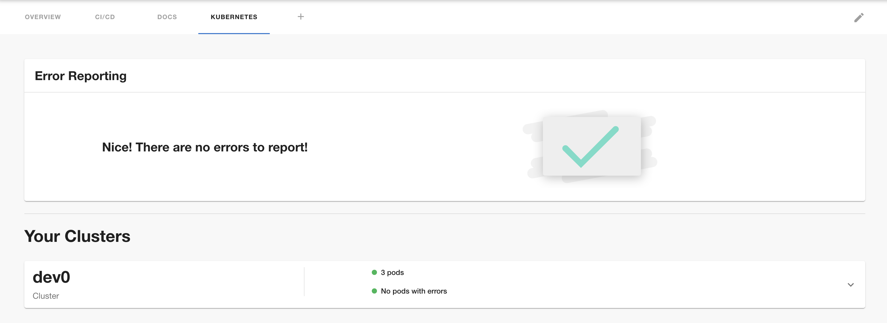

## AWS

## Introduction

In order to use the Kubernetes plugin for AWS, Roadie needs:
 * An Assumed Role to fetch the resources from your cluster
 * The name of your cluster
 * URL of your Kubernetes API Server endpoint


These are set within Roadie at the following url:

```text
https://<tenant-name>.roadie.so/administration/settings/kubernetes
```

This page describes how to create and set up the API token.

## Steps

In this section we will create an AWS role that will grant Roadie read-only access to your Kubernetes cluster’s resources.

We will use the approach which is recommended by AWS for providing this type of access. To learn more about the AWS concepts used below, you can read the following AWS documentation pages:

 * Assuming Role [learn more](https://docs.aws.amazon.com/STS/latest/APIReference/API_AssumeRole.html)
 * Cross Account Federation [learn more](https://docs.aws.amazon.com/IAM/latest/UserGuide/id_roles_common-scenarios_third-party.html)
 * Kubernetes RBAC [learn more](https://kubernetes.io/docs/reference/access-authn-authz/rbac/)
 * Trust relationship [learn more](https://aws.amazon.com/en/blogs/security/how-to-use-trust-policies-with-iam-roles/)

## Step 1: Creating the cross account federation role

Follow the steps [here](../../details/accessing-aws-resources) to create the role.

## Step 2: Set RBAC for new role

1. Edit your Kubernetes aws-auth Configmap as per [the EKS docs](https://docs.aws.amazon.com/eks/latest/userguide/add-user-role.html).

It should look something like this:

``` yaml
 - mapRoles:
   - "groups":
      - "system:authenticated"
      "rolearn": "ROLE ARN FROM STEP TWO"
      "username": "roadie"
```

⚠️ In the yaml snippet above, be sure to replace "ROLE ARN FROM STEP TWO" with the ARN of the role created from step 2.


2. Create an RBAC for this user:

``` yaml
---
apiVersion: rbac.authorization.k8s.io/v1
kind: ClusterRole
metadata:
  name: roadie-assume-role
rules:
  - apiGroups: [""]
    resources:
      - pods
      - configmaps
      - services
      - deployments
      - replicasets
      - horizontalpodautoscalers
      - ingresses
    verbs: 
      - "get"
      - "list"
      - "watch"
  - apiGroups: ["batch"]
    resources:
      - jobs
      - cronjobs
    verbs: 
      - "get"
      - "list"
      - "watch"
  - apiGroups: ["extensions", "apps", "autoscaling", "networking.k8s.io"]
    resources: ["deployments", "ingresses", "replicasets", "horizontalpodautoscalers"]
    verbs: 
      - "get"
      - "list"
      - "watch"
---
apiVersion: rbac.authorization.k8s.io/v1
kind: ClusterRoleBinding
metadata:
  name: roadie-assume-role-binding
roleRef:
  apiGroup: rbac.authorization.k8s.io
  kind: ClusterRole
  name: roadie-assume-role
subjects:
  - kind: User
    name: roadie
```

3. Add this to your cluster and you should now be good to go!

ℹ️ Note you can reuse the Role if you have multiple clusters. You will have to configure the RBAC though.

## Step 4: Adding a cluster to roadie

1. Navigate to your Kubernetes settings in Roadie and click on add item.

   ```
   https://<tenant-name>.roadie.so/administration/settings/kubernetes" 
   ```

2. Select the AWS provider
3. Add the load balancer url, role arn, external ID and name of cluster.
4. Click save and exit!

## GKE

## Introduction

In order to use the Kubernetes plugin for GKE, Roadie needs:
 * OAuth app credentials
 * The name of your cluster
 * URL of your Kubernetes API Server endpoint

 >  ℹ️  Note you will need read access (`Kubernetes engine viewer`) at a minimum to a cluster. Without read access, you will be unable to see your Kubernetes resources, with this configuration. ℹ️

These are set within Roadie at the following url:

```
https://<tenant-name>.roadie.so/administration/settings/kubernetes
```

This page describes how to create and set up the API token.

## Steps

In this tutorial, we will show you how to:

* Create a google OAuth client [learn more](https://developers.google.com/identity/protocols/oauth2)
* Setup OAuth client in backstage
* Setup Kubernetes clusters in Backstage

## Step 1: Creating an OAuth app

Follow step 1 from [here](../../integrations/google-oauth-client/).

## Step 2: Adding secrets to backstage

Follow step 2 from [here](../../integrations/google-oauth-client/).


## Step 3: Adding a cluster to roadie

1. Navigate to ”https://<tenant-name>.roadie.so/administration/settings/kubernetes” and click on add item.
2. Select the Google provider
3. Add the load balancer url and name of cluster.
4. Click save and exit!

> You will need to annotate your entities (catalog-info.yaml) with the following if you want to see data: ”backstage.io/kubernetes-label-selector: 'app=my-app,component=frontend'”
> For more details please vist [here](https://backstage.io/docs/features/kubernetes/configuration#common-backstageiokubernetes-id-label)
